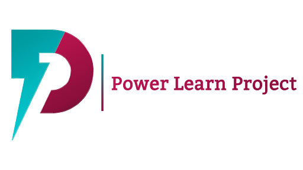

---
Power Learn Project Economic Empowerment Hackathon 2026
---

# 🚀 Economic Empowerment Hackathon 2026

### Theme: Economic Empowerment Through Community Innovation

*"Driving Grassroots Economic Innovation to Unlock Sustainable Livelihoods and Build Community Wealth."*

<link href="https://fonts.googleapis.com/css2?family=Poppins:wght@300;400;500;600;700;800&display=swap" rel="stylesheet">

---

# 👋 Welcome

Hello Trainees!

We're excited to invite you to participate in the **Power Learn Project Economic Empowerment Hackathon 2026**.

This is your opportunity to tackle pressing economic development challenges facing African communities and build innovative technology solutions that create measurable impact.

---

# 🎯 Theme

## Economic Empowerment Through Community Innovation

Economic empowerment transforms lives, strengthens communities, and drives sustainable development.

This challenge invites you to:

- Identify a **real economic problem** within your community.
- Conduct market research.
- Validate the problem with actual users.
- Design an innovative and scalable solution.
- Build an MVP capable of attracting your first **10–20 users** immediately after launch.

> **Think beyond another e-commerce platform.**
>
> Build something that genuinely solves a real problem.

---

# 💡 Challenge Statement

> **How might we use innovation and technology to create sustainable economic opportunities, strengthen local communities, and improve livelihoods through solutions that address real, validated needs?**

---

# 🛠 Hackathon Structure

---

## Phase 1 — Problem Statement Development

Every team must identify **two validated community problems** and develop corresponding solution statements.

Do **not** assume user needs.

Instead:

- Conduct market research.
- Talk to potential users.
- Observe existing workflows.
- Identify pain points.
- Validate assumptions.

For each problem provide:

- Problem Statement
- Target Users
- Why the problem matters
- Proposed Solution

This documentation becomes the foundation of your project.

### Skills Practiced

- Research
- Market Validation
- Documentation
- Critical Thinking

**Reference**

Week 1–3: Software Engineering Essentials

---

## Phase 2 — Development & Prototyping

Transform your research into a functional **Minimum Viable Product (MVP).**

Focus on:

- Core features
- User experience
- Deployment
- Demonstrating impact

Remember:

> Don't build everything.

Build **only what proves your solution works.**

---

# 🌍 Why Participate?

## 💰 Create Real Wealth

Build solutions that create financial independence and sustainable livelihoods.

---

## 🤝 Collaborate with Purpose

Work alongside fellow developers, mentors, entrepreneurs, and community leaders.

---

## 🚀 Build to Launch

Learn how to:

- Validate a business idea
- Build an MVP
- Acquire your first users
- Transform code into a real business

---

# 💭 Beginner-Friendly Project Ideas

### 📊 Digital Chama / Savings Tracker

A digital ledger for informal savings groups to record contributions, balances, and payment reminders.

---

### 📞 Neighborhood Service Directory

A local platform listing skilled workers with click-to-call functionality.

Examples:

- Plumbers
- Tutors
- Tailors
- Electricians

---

### 📝 Kiosk Credit Book

A bookkeeping application for small shops that tracks customer credit and automates WhatsApp reminders.

---

### 🍅 Farm-to-Neighbor Produce Board

A marketplace connecting nearby farmers with local buyers.

Reduce food waste while improving income.

---

### ⚙️ Tool & Equipment Sharing

Allow community members to rent tools like:

- Sewing machines
- Drills
- Lawn mowers

---

### 📦 Joint Buying Pool

Enable retailers or neighbors to combine purchases and buy inventory at wholesale prices.

---

# 🌍 Context-Based Ideas

- Human-Wildlife Conflict Reporting System
- Rangeland Carbon MRV as a Service
- Women's Maternal Health Platform
- Tourism & Camp Listings Platform

---

# 📅 Important Dates

| Activity | Date |
|-----------|------|
| Kick-off & Information Session | **27 July 2026** |
| Phase 1 – Research & Idea Search | **28 July 2026** |
| Research & Idea Review | **30 July 2026** |
| Phase 2 – Hackathon | **30 July – 1 August 2026** |
| Award Ceremony | **2 August 2026** |

---

# 🏆 Evaluation Criteria

| Category | Weight |
|----------|-------:|
| 🖥 Code Quality | **20%** |
| ⚡ Algorithm Efficiency | **20%** |
| 🌐 Technology Stack Utilization | **14%** |
| 🔒 Security & Fault Tolerance | **12%** |
| 🚀 Performance | **16%** |
| 🤝 Development Process | **10%** |
| 📚 Documentation & Testing | **8%** |

---

## 🖥 Code Quality (20%)

- Clean code
- Readability
- Maintainability
- Correct implementation

---

## ⚡ Algorithm Efficiency (20%)

- Efficient logic
- Resource optimization
- Fast execution

---

## 🌐 Technology Stack (14%)

Show how effectively you leveraged modern technologies.

Examples:

- Web
- Mobile
- APIs
- AI
- Cloud

---

## 🔒 Security & Fault Tolerance (12%)

Projects should:

- Protect user data
- Handle errors gracefully
- Recover from failures

---

## 🚀 Performance (16%)

Your solution should be:

- Fast
- Responsive
- Efficient

---

## 🤝 Development Process (10%)

We assess:

- Team collaboration
- Git workflow
- Planning
- Communication

---

## 📚 Documentation & Testing (8%)

Provide:

- README
- Architecture overview
- Installation guide
- Testing evidence

---

# 📤 Project Submission

Submit the following:

- Source Code
- Pitch Deck
- MVP Demo
- Documentation

### Google Form

> *(https://forms.gle/LzFjoecEPs4tCt6R9)*

---

# 🎉 Final Message

Technology has the power to transform communities.

This hackathon isn't just about writing code.

It's about creating sustainable solutions that empower people, strengthen local economies, and improve livelihoods.

We can't wait to see what you build.

---

# Happy Hacking! 🚀

### Power Learn Project

